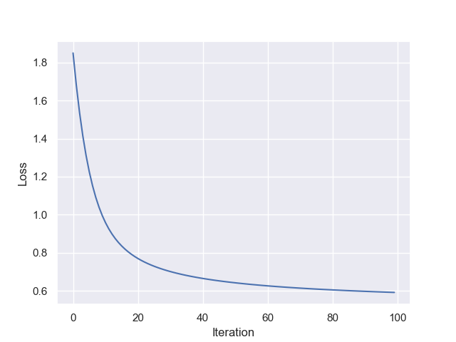

# Movie-Recommender 

Implemented a Collaborative Filtering Recommender System to predict ratings and recommend movies to users.

## Dataset Introdction

The dataset is taken from the Exercise-8 of [Machine Learning by Andrew Ng](https://www.coursera.org/learn/machine-learning). 

The dataset contains two 2-D arrays Y and R where Y contains the ratings provided to 1682 movies by 943 users. Each user has not rated all the 1682 movies. R is a mask matrix of size same as Y(1682 * 943) where _R[i,j]==1_ if the movie _i_ is rated by user _j_.

## Performance Analysis

The above plot shows the loss of the model with iteration. 
